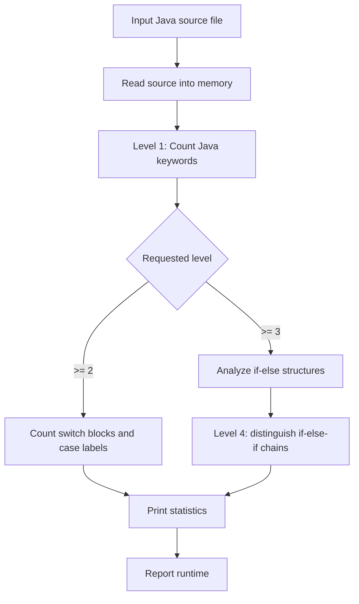

<div align="center">

# EE308 Lab
### Java Source-Code Keyword and Control-Structure Analyzer


</div>

## Overview

This repository contains an early **EE308 Software Engineering** laboratory implementation. The main program, `src/lab2.java`, reads a Java source file as text and performs several levels of lightweight static analysis using **regular expressions, stacks, file I/O, and runtime measurement**.

The exercise is useful as a compact example of transforming a course specification into a staged analysis pipeline.

## Analysis Levels

The program accepts a source-file path and an analysis level.



### Level 1 — Keyword Counting

The implementation defines a list of Java language keywords and uses regular-expression matching to count occurrences in the loaded source code.

### Level 2 — `switch` / `case` Analysis

The analyzer counts `switch` occurrences and estimates the number of `case` labels associated with switch sections.

### Levels 3–4 — Conditional Structure Analysis

A regular expression extracts `if`, `else if`, and `else` tokens. A stack-based pass then distinguishes simpler `if-else` structures from longer `if-else-if-else` chains.

### Runtime Measurement

The program records start/end time and prints the elapsed execution time after analysis.

## Repository Structure

```text
EE308_Lab/
├── src/
│   └── lab2.java            # Source-code analysis program
├── out/                     # IntelliJ-generated compiled output
├── .idea/                   # Original IDE metadata
├── EE308_IDEA.iml
└── README.md
```

## Key Java Concepts Practiced

- file input with `FileReader` / `BufferedReader`;
- command-line interaction with `Scanner`;
- regular expressions with `Pattern` and `Matcher`;
- Java collections (`List`, `Stack`);
- string processing;
- staged program requirements;
- simple performance timing.

## Running

Compile the source:

```bash
javac src/lab2.java
```

Run the generated class according to your local classpath/layout. The program expects two interactive inputs:

```text
<path-to-java-source-file>
<analysis-level>
```

For example, analysis level `4` runs the full set of implemented checks.

## Limitations

This is a course exercise, not a production Java parser. Regex-based source analysis can miscount tokens inside comments, strings, nested constructs, or unusual formatting. A production implementation would normally use a Java lexer/parser or compiler AST. The repository intentionally preserves the original solution as part of the learning history.

## Portfolio Context

The lab documents early experience with **text processing, program analysis, data structures, and translating multi-level requirements into code**.

## Author

**Bo Liu**  
Contact: `liubo317@hnu.edu.cn`  
Homepage: https://boliupro.github.io
